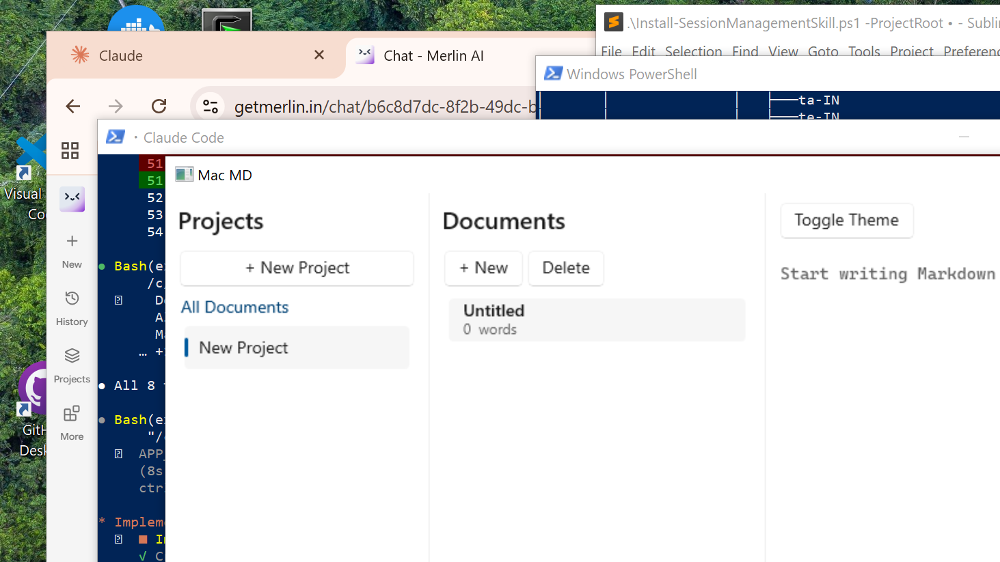

# Mac MD for Windows

A native Windows Markdown editor built with **WinUI 3** and **.NET 8**, porting the [Mac MD](https://github.com/bbsbot/mac-md) SwiftUI app to Windows 10/11.

**[Download Alpha 2](https://github.com/bbsbot/mac-md-win/releases/tag/v0.2.0-alpha)** — extract, run `MacMD.Win.exe`, no installer needed.



---

## What It Does Today

- **Three-column layout** — Projects | Documents | Editor + Live Preview
- **Live Markdown preview** — type in the editor, see rendered HTML update in real-time (300ms debounce) via WebView2
- **Local persistence** — projects, documents, and tags stored in SQLite at `%LOCALAPPDATA%\MacMD\macmd.db`
- **Auto-save** — your work is saved 2 seconds after you stop typing
- **10 terminal-inspired themes** — Pro, Homebrew, Ocean, Red Sands, and more — colors apply to editor, preview, and app background
- **Formatting toolbar** — Bold, italic, heading, link, code, bullet list, numbered list, blockquote, horizontal rule
- **Full CRUD** — right-click projects to rename/delete, tags to rename/change color/delete, documents to rename/duplicate/archive
- **Archived documents** — sidebar filter to view and unarchive
- **Preview links open in browser** — external links in the preview open in your default browser
- **Localization** — 23 locales supported via generated `.resw` resources
- **Export** — File → Export as HTML or PDF (via WebView2 print-to-PDF)

## Tech Stack

| Layer | Technology |
|-------|-----------|
| UI Framework | WinUI 3 (Windows App SDK 1.6) |
| Runtime | .NET 8 (C# 12) |
| Markdown | [Markdig](https://github.com/xoofx/markdig) with advanced extensions |
| Preview | WebView2 with theme-aware CSS |
| Persistence | SQLite via `Microsoft.Data.Sqlite` |
| MVVM | [CommunityToolkit.Mvvm](https://learn.microsoft.com/en-us/dotnet/communitytoolkit/mvvm/) |
| Packaging | Self-contained (no runtime install needed) |

## Building From Source

**Requirements:** Visual Studio 2022 Build Tools with UWP workload, .NET 8 SDK

```bash
# Clone
git clone https://github.com/bbsbot/mac-md-win.git
cd mac-md-win

# Build (must use MSBuild, not dotnet build, for WinUI 3)
"C:\Program Files (x86)\Microsoft Visual Studio\2022\BuildTools\MSBuild\Current\Bin\amd64\MSBuild.exe" MacMD.sln -restore -p:Platform=x64

# Run tests (dotnet works for non-WinUI projects)
dotnet test src/MacMD.Tests

# Launch
src\MacMD.Win\bin\x64\Debug\net8.0-windows10.0.19041.0\MacMD.Win.exe
```

## Project Structure

```
mac-md-win/
├── src/
│   ├── MacMD.Core/          # Domain models + services (no UI dependency)
│   │   ├── Models/          # Document, Project, Tag, ColorTheme
│   │   └── Services/        # MarkdownService, DatabaseService, stores
│   ├── MacMD.Win/           # WinUI 3 app
│   │   ├── ViewModels/      # EditorViewModel, ProjectList, DocumentList
│   │   └── Views/           # EditorView, PreviewView, list views
│   └── MacMD.Tests/         # xUnit tests (8 passing)
├── tools/                   # Screenshot tool, build helpers
├── docs/                    # Milestone progress, architecture decisions
└── DESIGN.md                # Full architecture document
```

## Development Progress

See **[PROGRESS.md](PROGRESS.md)** for a detailed milestone-by-milestone breakdown with code highlights.

| Milestone | Status | Description |
|-----------|--------|-------------|
| M0 — Scaffolding | Done | Solution structure, CPM, build tooling |
| M1 — App Shell | Done | Three-column layout, theme toggle, DI |
| M2 — Preview Pipeline | Done | Markdig + WebView2 live preview |
| M3 — Persistence | Done | SQLite CRUD, auto-save, navigation |
| M4 — Localization | Done | 23-locale .resw generation |
| M5 — Export | Done | HTML + PDF export |
| M6 — Parity & Polish | Done | Themes, CRUD, toolbar, context menus, archived view |
| M7 — Localization | Next | Full 38-language parity with Mac app |

## How This Project Is Built

This app is built entirely by **Claude Code agents** — AI pair programming from architecture through implementation. The human tests at milestone gates. See [PROGRESS.md](PROGRESS.md) for the full story.

## License

TBD
